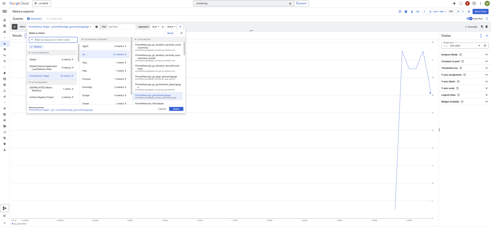
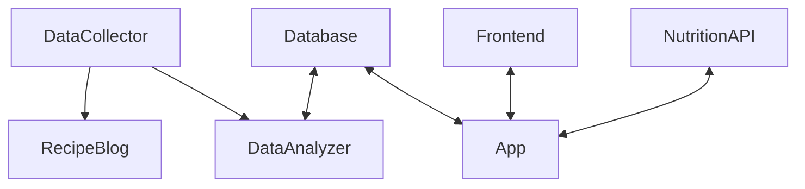

# 🍽️ Nutrition Helper – Capstone Project (Team 3)

A web-based nutrition tracking system designed to help users log food entries, monitor nutritional intake, and receive personalized suggestions using third-party APIs. Built with a focus on modularity, scalability, and test-driven development.

---

## Project Overview (Rubric)

- **Web Application:**  
  [`https://s25-team-3-capstone-450859268851.us-central1.run.app/`](https://s25-team-3-capstone-450859268851.us-central1.run.app/)
    - Basic form and reporting interface implemented using React and Go.

- **Data Collection:**
    - Implemented under `cmd/collector` for gathering user preferences and meal data.

- **Data Analyzer:**
    - Implemented under `cmd/analyzer`, responsible for analyzing user data and processing nutrition insights.

- **Unit Tests:**
    - Located in `internal/unittests`, covering core logic (e.g., auth, food entries, recipe suggestions).

- **Data Persistence:**
    - PostgreSQL (hosted via Neon).
    - SQL schema available at `databases/starter/001_create_users_table.up.sql`.

- **REST API Collaboration:**
    - Backend API routes in `internal/routers/api_routes.go` for authentication, food entry, profile, and more.

- **Product Environment:**
    - Managed using GitHub Projects for sprint planning, issue tracking, and task assignment.
    - Deployment URL: [`https://s25-team-3-capstone-450859268851.us-central1.run.app/`](https://s25-team-3-capstone-450859268851.us-central1.run.app/)

- **Integration Tests:**
    - Located in `internal/integrationtests`

- **Use of Mock Objects / Test Doubles:**
  - `internal/unittests`

- **Continuous Integration:**
    - Implemented with **GitHub Actions** at `.github/workflows/test-and-build.yml`
    - Auto-run test suite on every push to `main`

- **Production Monitoring & Instrumentation:**
    - Exposed Prometheus metrics endpoint at:  
      [`/metrics`](https://s25-team-3-capstone-450859268851.us-central1.run.app/metrics)
  - Integrated with **GCP Cloud Monitoring → Metrics Explorer**
      - Observability for response time, error rates, and uptime

      
  - Located in `cmd/app/main.go`

- **Acceptance Tests:**
    - Tested end-to-end flow: [End-to-End Test Flow](https://drive.google.com/file/d/1gQB7o1rmXu9C5WKvPWd2KbT43f4SJg3H/view?usp=sharing)

- **Event Collaboration / Messaging:**
    - Implemented Google Pub/Sub
    - Located in `internal/utils/pubsub.go`

- **Continuous Delivery:**
    - Automatic deployment via GitHub Actions & GCP Cloud Build
    - `.github/workflows/test-and-build.yml`


---

# Capstone Starter

A capstone starter application.

## Technology stack

This codebase is written [Go](https://go.dev/) using Go's built-in [server](https://pkg.go.dev/net/http) and [templates](https://pkg.go.dev/html/template).
It stores data in [PostgreSQL](https://www.postgresql.org/).
A [GitHub Action](https://github.com/features/actions) runs tests and builds a container.

## Architecture

The Capstone Starter consists of three applications communicating with one Postgres database.

1.  The data collector is a background process that collects data from one or more sources.
1.  The data analyzer is another background process that processes collected data.
1.  The web application displays results to the user.



| Component     | Service                                                                        |
| ------------- | ------------------------------------------------------------------------------ |
| App (Backend) | Google Cloud Run                                                               |
| Database      | Neon                                                                           |
| Frontend      | Google Cloud Run                                                               |
| DataAnalyzer  | Google Cloud Run                                                               |
| DataCollector | Google Cloud Run                                                               |
| Nutrition API | [Nutritionix API](https://trackapi.nutritionix.com/v2/natural/nutrients) |
| Recipe Blog   | [Emily Bites](https://emilybites.com/2010/12)                                  |

## Local development

1.  Install [Go](https://formulae.brew.sh/formula/go) and [PostgreSQL 17](https://formulae.brew.sh/formula/postgresql@17).

    ```shell
    brew install go postgresql@17
    brew services run postgresql@17
    ```

1.  Create and migrate the local databases.

    ```shell
    psql postgres < ./databases/create_databases.sql
    DATABASE_URL="user=starter password=starter database=starter_development host=localhost" go run ./cmd/migrate
    DATABASE_URL="user=starter password=starter database=starter_test host=localhost" go run ./cmd/migrate
    ```

1.  Copy the example environment file and fill in the necessary values.

    ```shell
    cp .env.example .env
    source .env
    ```

1.  Run the collector and the analyzer to populate the database, then run the app and navigate to
    [localhost:8778](http://localhost:8778).

    ```shell
    go run ./cmd/collector
    go run ./cmd/analyzer
    go run ./cmd/app
    ```

## Create a database schema migration

Create a numbered `.sql` file in the `databases/starter` directory to create a new database schema migration.

```shell
touch databases/starter/001_description_of_change.up.sql
```

## Build container

1. Build container

   ```shell
   docker build -t capstone-starter .
   ```

1. Run with docker
   ```shell
   docker run --env-file .env.docker --entrypoint collector capstone-starter
   docker run --env-file .env.docker --entrypoint analyzer capstone-starter
   docker run -p 8778:8778 --env-file .env.docker capstone-starter
   ```

## Link to Postman Workspace

```
https://www.postman.com/mern14/workspace/fose-cub
```
